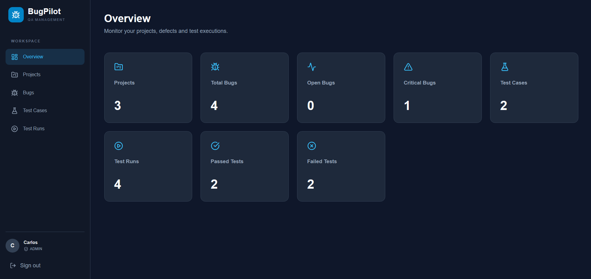
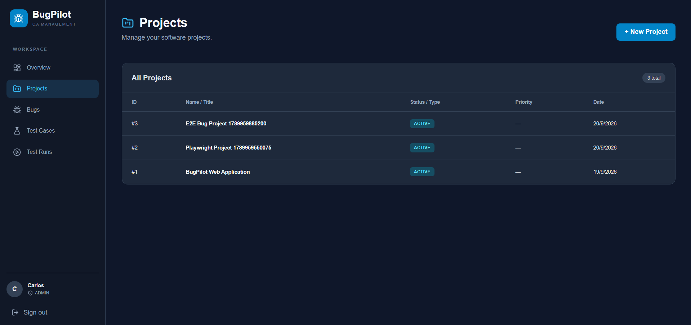
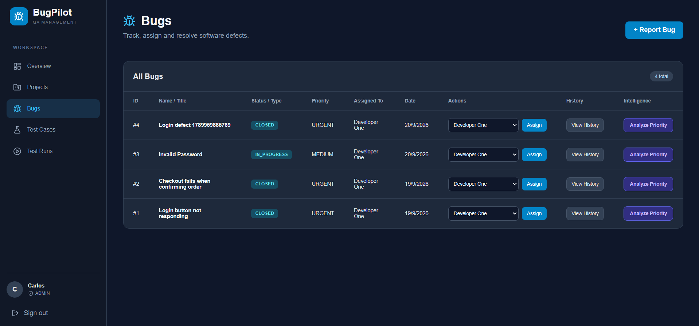
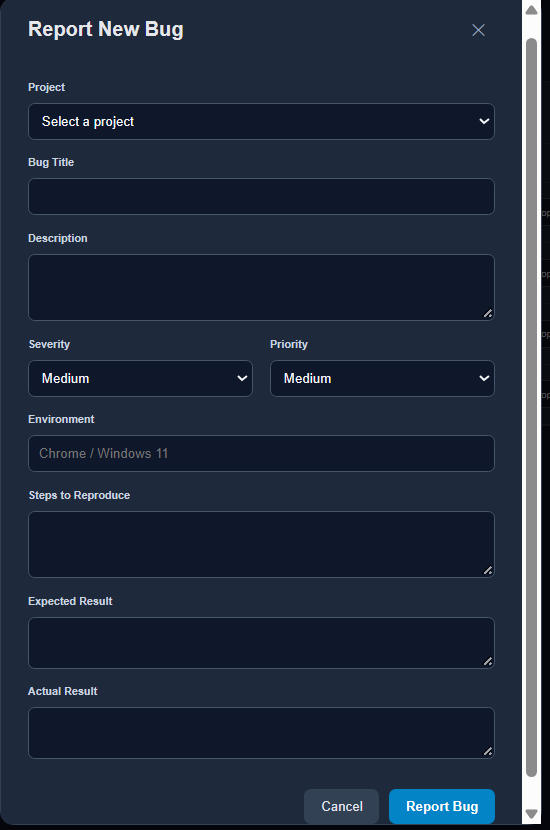
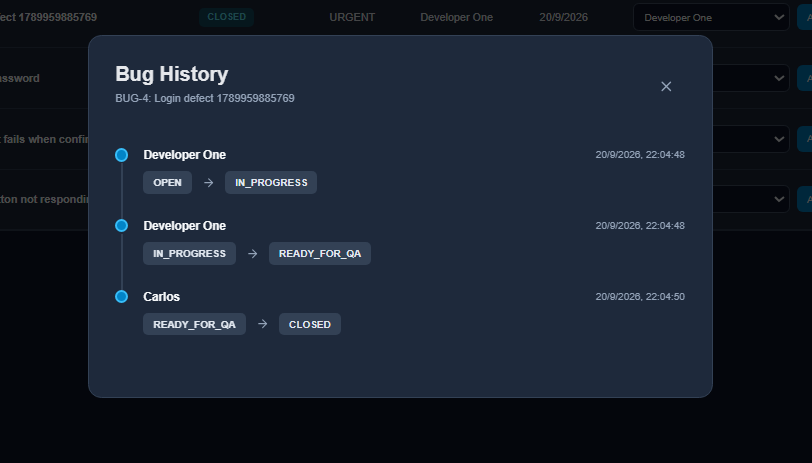
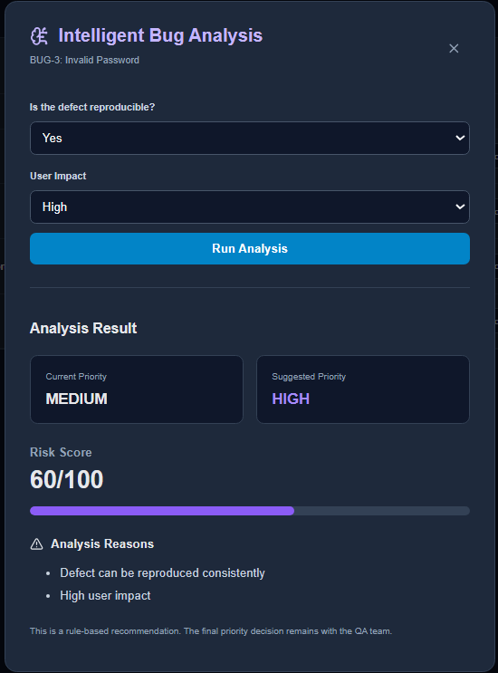
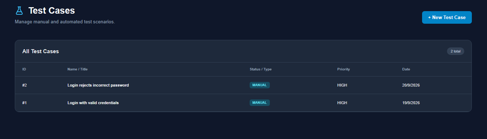
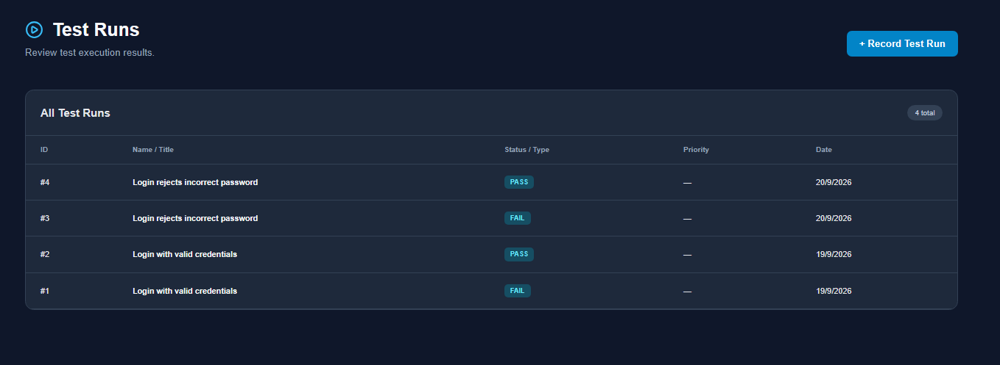
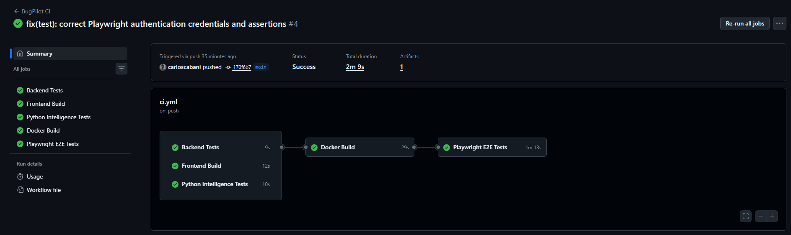

# BugPilot — QA Management Platform

**A full-stack, QA-focused platform for tracking software defects, managing test cases, recording test runs, and supporting bug triage with an explainable Python service.**

BugPilot connects the work of administrators, QA engineers, and developers through a role-aware defect workflow. It brings project management, bug reports, test execution, activity history, and priority suggestions into a single web application.

> **Project status:** Functional portfolio project with a Docker Compose setup and a passing GitHub Actions pipeline. The intelligence engine is **rule-based**, not a trained machine-learning model.

## Features

- **Authentication and roles:** JWT-based sign-in and authorization for `ADMIN`, `QA`, and `DEVELOPER`.
- **Projects:** Create and browse software projects.
- **Defect tracking:** Record bugs with severity, priority, environment, reproduction steps, and expected versus actual results.
- **Assignment and workflow:** Assign bugs to developers and update their status using role-based transitions.
- **Bug history:** Inspect recorded status changes and the users responsible for them.
- **Test management:** Create test cases, associate them with projects and optionally bugs, and record manual execution results (`PASS`, `FAIL`, `BLOCKED`).
- **Dashboard:** View project, defect, and test-execution statistics.
- **Explainable triage:** Request a suggested bug priority and a score with reasons, based on severity, current priority, reproducibility, and estimated user impact. Suggestions **do not automatically overwrite** a bug's priority.

## Technology stack

| Layer | Technologies |
| --- | --- |
| Frontend | React, TypeScript, Vite, React Router, Axios |
| Backend | Node.js, Express, TypeScript, JWT, bcrypt |
| Data | PostgreSQL 16, SQL migrations |
| Triage service | Python, FastAPI, Pydantic |
| Infrastructure | Docker, Docker Compose, Nginx |
| Backend testing | Vitest, Supertest |
| Python testing | Pytest, FastAPI TestClient |
| Browser E2E testing | Playwright (Chromium) |
| CI | GitHub Actions |

## Architecture

```text
Browser
  |
  v
React + TypeScript / Nginx  (localhost:5173)
  |  /api/*
  v
Express + TypeScript       (localhost:3000)
  |                 |
  v                 v
PostgreSQL          Python + FastAPI
(database:5432)     (intelligence:8000, internal)
```

The frontend calls the Express API. Express reads and writes to PostgreSQL and calls the FastAPI service for triage suggestions. Inside Docker, services communicate using their **Compose service names**, not `localhost`.

## Bug lifecycle

```text
OPEN -> IN_PROGRESS -> READY_FOR_QA -> CLOSED
                           |
                           v
                        REOPENED -> IN_PROGRESS
```

The UI offers transitions appropriate to the logged-in user's role; the backend remains the authority for authentication, authorization, and workflow validation. A closed bug has no outgoing transition in the implemented workflow.

## Run with Docker Compose

### Requirements

- Docker Desktop with Docker Compose (or an equivalent Docker Engine + Compose setup)
- Available host ports: `5173`, `3000`, and `5432`

### 1. Clone and configure

```bash
git clone https://github.com/carloscabani/bugpilot-qa-platform.git
cd bugpilot-qa-platform
cp backend/.env.example backend/.env
```

Check `backend/.env` before starting. The **current Compose file contains development-only PostgreSQL credentials** and overrides the backend's database host and triage-service URL. Keep `DB_USER`, `DB_PASSWORD`, and `DB_NAME` consistent with the `database` service in `docker-compose.yml`. Set a locally generated `JWT_SECRET`, for example:

```bash
openssl rand -hex 32
```

Copy the generated value into `backend/.env`; do not commit it. The supplied Compose configuration is intended for **local development and demonstrations**, not a public production deployment.

### 2. Build and start

```bash
docker compose up --build -d
```

Compose starts PostgreSQL, the Python service, the migration job, the backend, and the frontend. Wait until the database and intelligence service are healthy and migrations have finished.

```bash
docker compose ps -a
```

The one-off `migrations` service should finish successfully (`Exited (0)`); the main application services should remain running.

### 3. Open BugPilot

- **Web app:** http://localhost:5173/login
- **Backend health:** http://localhost:3000/api/health

The Python service is available to the backend at `http://intelligence:8000` on the Compose network; it is not published on a host port in the current Compose configuration.

> **Accounts:** The project does not ship with a universal demo account. Create or provision appropriate users in your own development environment before signing in. The CI workflow provisions separate temporary test users automatically.

### Useful commands

```bash
docker compose logs -f backend
docker compose logs -f intelligence
docker compose down
```

The named PostgreSQL volume preserves data across ordinary `docker compose down` / `up` cycles. **Do not use `docker compose down -v` if you want to keep your data.** Also note that `database/init.sql` runs automatically only when PostgreSQL initializes a new, empty data directory; the migration job handles subsequent schema changes.

## Local development (without running the app services in Docker)

Start PostgreSQL with Docker and run the application services from separate terminals:

```bash
# Repository root
docker compose up -d database
```

```bash
# backend/
npm ci
npm run dev
```

```bash
# frontend/
npm ci
npm run dev -- --host 0.0.0.0
```

```bash
# intelligence-engine/
python3 -m venv .venv
source .venv/bin/activate
python -m pip install -r requirements.txt
uvicorn main:app --reload --host 0.0.0.0 --port 8000
```

For this **host-based** mode, configure the backend's `DB_HOST=localhost` and `INTELLIGENCE_URL=http://127.0.0.1:8000`; those values differ from the Compose-internal addresses. Install the extra Python test dependencies (`pytest` and `httpx`) if you plan to run Python tests locally.

## Automated tests

BugPilot exercises different parts of the system at different testing levels:

| Scope | Command | Verified CI result |
| --- | --- | --- |
| Backend unit/API tests | `cd backend && npm test` | 13 passed |
| Python triage tests | `cd intelligence-engine && python -m pytest -v` | 4 passed |
| Browser E2E | `cd frontend && npm run test:e2e` | 4 passed |
| Frontend build | `cd frontend && npm run build` | Passed |
| Backend build | `cd backend && npm run build` | Passed |
| Docker images | See CI workflow | Passed |

**Playwright scenarios** cover successful and unsuccessful sign-in, project creation, and a multi-role bug workflow (administrator → developer → administrator). Local E2E runs require the backend, database, and suitable test accounts. E2E credentials are supplied through `E2E_ADMIN_EMAIL`, `E2E_ADMIN_PASSWORD`, `E2E_DEV_EMAIL`, and `E2E_DEV_PASSWORD` rather than hard-coded in the tests.

The GitHub Actions workflow provisions a **temporary `bugpilot_test` PostgreSQL database** and test accounts for its Playwright job; it does not depend on the developer's local database.

### Continuous integration

Workflow: [`.github/workflows/ci.yml`](.github/workflows/ci.yml)

CI runs on pushes and pull requests targeting `main` and can be started manually. Its five jobs are:

1. Backend Tests
2. Frontend Build
3. Python Intelligence Tests
4. Docker Build
5. Playwright E2E Tests

**Last verified result shared during development:** all five jobs passed. See the repository's **Actions** tab for the current status.

## Repository layout

```text
.
├── .github/workflows/ci.yml
├── backend/
│   ├── src/
│   │   ├── config/ controllers/ middleware/ routes/
│   │   ├── scripts/ services/ tests/ types/
│   │   ├── app.ts
│   │   └── server.ts
│   ├── Dockerfile
│   └── vitest.config.mts
├── database/
│   ├── init.sql
│   └── migrations/
│       ├── 001_create_bugs.sql
│       ├── 002_create_bug_history.sql
│       ├── 003_create_test_cases.sql
│       └── 004_create_test_runs.sql
├── frontend/
│   ├── src/
│   ├── tests/e2e/
│   ├── playwright.config.ts
│   ├── nginx.conf
│   └── Dockerfile
├── intelligence-engine/
│   ├── main.py
│   ├── test_main.py
│   ├── requirements.txt
│   └── Dockerfile
├── docs/
└── docker-compose.yml
```

## Triage engine: scope and limitations

The FastAPI engine uses a **transparent weighted rule set** to return a suggested priority, score, and reasons. Its weights are initial project heuristics rather than validated real-world risk estimates. The engine does not train on historical defects, infer affected-user counts, or make a final priority decision for the team. The existing analysis endpoint is protected for `ADMIN` and `QA` roles.

## Security and deployment notes

- Treat Compose credentials and any sample accounts as **development-only**.
- Never commit `backend/.env`, real passwords, tokens, or production secrets.
- Use dedicated secrets, stronger operational controls, and an appropriately secured database before exposing the application publicly.
- Docker Compose provides a reproducible **local/demo deployment**, not by itself a hosted public URL.

## 📸 Application Screenshots

Explore BugPilot's main features through its web interface.

### Dashboard

Real-time overview of projects, defects, test cases, and execution results.



### Project Management

Create and manage software projects from a centralized workspace.



### Bug Tracking

Report, assign, prioritize, and monitor software defects throughout their lifecycle.



### Bug Reporting

Structured defect reporting with severity, priority, environment, reproduction steps, and expected versus actual results.



### Bug History

Track status transitions, responsible users, and timestamps for improved traceability.



### Intelligent Bug Analysis

Explainable rule-based priority recommendations powered by Python and FastAPI.



### Test Case Management

Create and organize manual and automated test cases linked to software projects and defects.



### Test Execution

Record and review test execution results, including PASS, FAIL, and BLOCKED.



### CI/CD Pipeline Results

BugPilot uses GitHub Actions to automatically validate the application through five independent jobs:

- Backend Tests — Vitest and Supertest
- Frontend Build — React and TypeScript
- Python Intelligence Tests — Pytest
- Docker Build — Container image validation
- Playwright E2E Tests — Automated browser workflows



## Future improvements

- Broader authorization, validation, and database integration tests.
- More detailed test reporting and coverage metrics.
- Production-ready configuration and public hosting.
- A trained and evaluated ML model, if an appropriate defect dataset becomes available.

---

